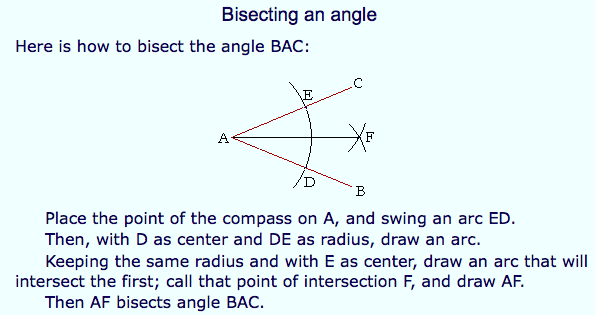

# [fit] Algorithms, not Al Gore's Rhythm


---

# About Me

---


^ Back End Instructor at The Iron Yard

---


^ I have promised my girlfriend that I would include a photo of our dog Riley in each presentation I do.

^ I am the Backend Instructor here at The Iron Yard.

---

# telephony


---

# space


^ Worked in the aerospace industry on command-destruct systems for rocket launches

---

# signage


^ Built digital signage systems using Rails, Content Distribution Systems, and a custom Linux OS for embedded devices

---

# Algorithms

^ Like any good presentation lets give the boring definition

---

> Self-contained step-by-step set of operations to be performed.

^ And another definition...

---

> Algorithms perform calculation, data processing, and/or automated reasoning tasks.

^ And another definition...

---

> An algorithm is an effective method that can be expressed within a finite amount of space and time and in a well-defined formal language for calculating a function.

^ And another definition...

---


^ WHAAAAAT?

---

# [fit] We use them in life all the time

---

# [fit] Examples

---


^ Giving specifc directions to someone on how to drive from place to place

^ Going to come back to directions later.

---

#### http://bit.ly/1tsqopI


^ Followed, created, or modified a recipe for cooking

---

#### http://bit.ly/1Pp7bZY


^ "Place Tab A into Slot B"

---


^ Draw two circles

^ Draw the rest of the damn owl

---

# [fit] More formal

^ These are casual examples of algorithms we use or create all the time

^ Time to bring back that horror of high school math: Geometry

---



^ Formal construction for bisecting the angle

---

# Euclid's Algorithm for GCD

```C
while (A != B) {

 if (A > B)
   A = A - B
 else
   B = B - A

}

return A
```

^ Try an example on a whiteboard:
  GCD of (a) 210, (b) 45
    A > B (210 > 45) => A = 210 - 45 => 165
    A > B (165 > 45) => A = 165 - 45 => 120
    A > B (120 > 45) => A = 120 - 45 => 75
    A > B (75 > 45) => A = 75 - 45 => 30
    else  (30 > 45) => B = 45 - 30 => 15
    A > B (30 > 15) => A = 30 - 15 => 15
    A == B (15 == 15) => 15

---

# [fit] Must be precise and complete

---

# [fit] "Make a PB&J Sandwich"

^ Give a couple of example tries

^ Show that nearly every step we think is precise, could be more precise

^ Suggest people try at home

---

# [fit] This is the :key: to mastering programming

---


^ When starting out with algorithms, the more detail we include, even to the point where it may seem silly, the better developers we will be.

---

    1. Read the problem completely twice.
    2. Solve the problem manually with 3 sets of sample data.
    3. Optimize the manual steps.
    4. Write the manual steps as comments or pseudo-code.
    5. Replace the comments or pseudo-code with real code.
    6. Optimize the real code.

^ https://simpleprogrammer.com/2011/01/08/solving-problems-breaking-it-down/

---

# Read the problem completely twice.

    - Most important!
    - Can you explain it (simply) to someone else?

---

# Solve the problem manually

    - Programming is automation
    - Solve the problem manually
    - Maybe even on pen and paper
    - Or use physical objects
    - Practice!

---

# Optimize the manual solution

    - Can you remove steps?

---

# Write pseudo-code or comments

    - Open an editor and write the manual steps in English

---

# Replace comments with real code

    - Replace each individual steps with code

---

# Example

-
-
-
-

## [fit] Reverse a string

---

    1. Write “Zebra” down.
    2. Create a new empty word.
    2. Start at the last letter in the word (the "a" from Zebra)
    3. Append the current letter to the new word
    4. If there is a previous letter,
       make the previous letter the current
       letter and start back at 3.

---

# Pseudo code

    1. NewWord = ""
    2. Loop backwards through word to reverse
    3.   NewWord += CurrentLetter
    4. Return NewWord

---

# Code (Ruby)

```
word = "Zebra"

new_word = ""
word.chars.reverse_each do |letter|
  new_word += letter
end

new_word # => "arbeZ"
```

---

# Sorting!

---

# [fit] Simplest Sorting EVAR

---

# Bubble sort


^ https://www.flickr.com/photos/shannonlofthus/4670090955/in/photolist-87Frkz-WHY5B-8mahpK-hN6juM-r7AJpA-ajYWaD-6zd2fV-nhgRbE-86k6Pf-38z42x-indd8g-o92k4j-btkhTp-8as94X-gdM5mg-nuoPxX-8ibJQ1-h2paWu-rqZ7-2wtUmq-7LYqqC-7yGiBn-2VD8P9-bWUbbw-6dXEed-ayCXtz-9VZvt5-ah6cUm-7aNK5e-dM9tRD-bytmvQ-fdgM3t-fMGVce-oDBmtB-fpCiAy-9GxMTc-iALYdC-9gcyYE-e5xtKs-xYMme-5TBqfJ-etJxvL-9TRW6k-4ZPTPC-9JtZ4F-96g9Ms-anRjkS-cqPJ9b-aqFvbJ-85xV3n

---

> For each two adjacent elements:

> Exchange them if out of order

> Repeat until array is sorted.

---

^ explain ... in range

^ explain each_cons

```ruby
array = [7,1,2,9,4,5]

def bubble_sort(array)
  loop do
    sorted = true
    (0...array.length).each_cons(2) do |first, second|
      if array[first] > array[second]
        array[first], array[second] = array[second], array[first]
        sorted = false
      end
    end
    break if sorted
  end
end
```

---


- https://github.com/AIRTucha/SortVis

---

### A moment of zen


^ https://www.flickr.com/photos/91604813@N03/8439070389/in/photolist-dRJrBB-s4K1VU-p6DwNY-dRQ271-csLT6L-s5HH9C-53sRLW-p6GeRy-edcCWC-nWCE27-nv6aQE-anoGck-anoFKK-7ius6w-sntwEE-nHEyJ7-anrLr1-ay5Dmf-eijpgL-eimZwd-eidF5v-ekmQMh-anrBX9-dRJrCg-anxCHQ-53oCGD-ay2W6B-54vk5W-anuNNk-anoDX8-anrKnG-dH8fwH-qanAxd-ay5DCW-8VRU3W-poMWLN-ekmnqN-fy8aDK-G78Jjz-anrJWw-anrKLb-anoYUR-5oUwi3-eidEGz-eijpkb-g4cW9M-ein3Yy-eidEQV-b6uVeB-a6v8Lx

^ Moment of zen

---

# [fit] Algorithm Complexity

^ How do we know how "good" or algorithm is?

---

# Measure
- the number of operations required => _time_
- the amount of memory required     => _space_

---

> Best case
-
-
> Worst case
-
-
> Average case
-
-

^ Best case - if the data is perfect for *this* algorithm, how fast
  Worst case - if the data is terrible for *this* algorithm, how slow
  Over all possible inputs, what is the average speed of the algorithm

---

# What are we measuring?

^ When we speak of algorithm complexity, what are we measuring?
  Operations: comparisons, increments.

---

# Example: Searching

---


^ Binary search we half the amount of comparisons we need to do
  each time we make a decision. This is worst case log(n)

^ The linear search has to compare every element until it finds it.
  Worst case is O(n)

---

# [fit] Big O notation

---

> `O(n)`
> `O(n^2)`
> `O(log n)`
> `O(n log n)`

---


---

## Salesperson


^ Imagine you are a traveling salesperson.

---


^ What is the best route for the salesperson to visit each city only once, returning
  to the starting city at the end?

---

# [fit] Could you find it by hand?

---

# [fit] Probably, for a small number of cities!

---


^ Upwards of 400,000 iterations for about 50 cities

---

> The TSP has several applications
- planning
- logistics
- manufacturing of microchips
- DNA sequencing.

---

# [fit] For More info

# [fit] http://bit.ly/XUXLXWX

---

# [fit] Algorithms Matter

---

# [fit] Understanding Complexity Matters

---

## Understanding How to Break Problems Down Effectively REALLY Matters

---

# Being a Developer

    1. Understanding the problem
    2. Break it down into small steps
    3. Break it into even smaller steps
    4. Translate this to code
    5. Appreciate the complexity

---

# [fit] Thank You

---

# [fit] Questions?
